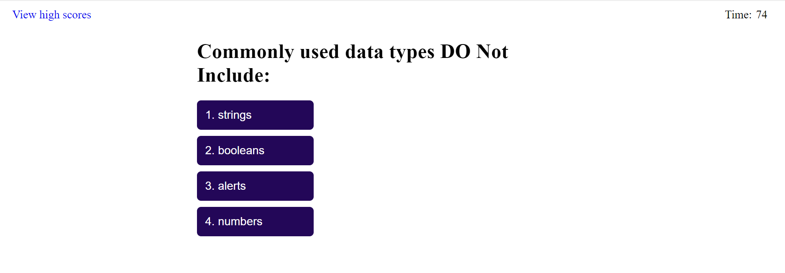
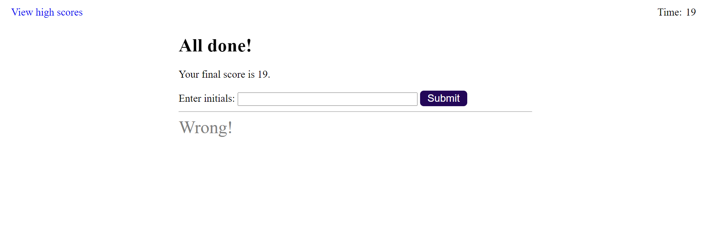

# Trevors-Timed-Quiz
Create a webpage that ask the user a series of multiple choice questions while being timed.  allow the user to view their high scores on another page.  

## Project Description
There are two pages.  One is for taking the quiz and storing the users initials and score to the local storage.  The other page displays a list of 
all stored scores on the local storage.  There is an option on the second page to clear all of the scores.  
1st Page:   
Start:  
  
Quiz questions:  
  
  
  
  
  
End:  
   
2nd Page:  
  

## How to Get to the Page  
The link to the repo for this project is located at: https://github.com/blanchardt/Trevors-Timed-Quiz/settings/pages   
You can use this link to get to the live site for the quiz: https://blanchardt.github.io/Trevors-Timed-Quiz/index.html  
You can use this link to get to the live site to view the high scores on your local machine: https://blanchardt.github.io/Trevors-Timed-Quiz/highscores.html  

## Credits  
Modified by: Trevor Blanchard   

### script.js and highscores-script.js:  

script.js line 199, highscores-script.js line 37:  
Went to https://stackoverflow.com/questions/13071967/adding-an-onclick-function-to-go-to-url-in-javascript to find info on how to make 
an on click event open up a new url page that allows the user to hit the back button as well.  Also credited in the README file.
John Taylor, Rick Donohoe, Aamir Shahzad, azzy81, T.W.R. Cole, Moji, Jack J, Darvydas Šilkus, Nigel, Kamil Kiełczewski, Kamil 
    Kiełczewski, &amp; aziz_alqudsy. (2012, October 25). Adding an onclick function to go to URL in 
    JavaScript?. Stack Overflow. https://stackoverflow.com/questions/13071967/adding-an-onclick-function-to-go-to-
    url-in-javascript  